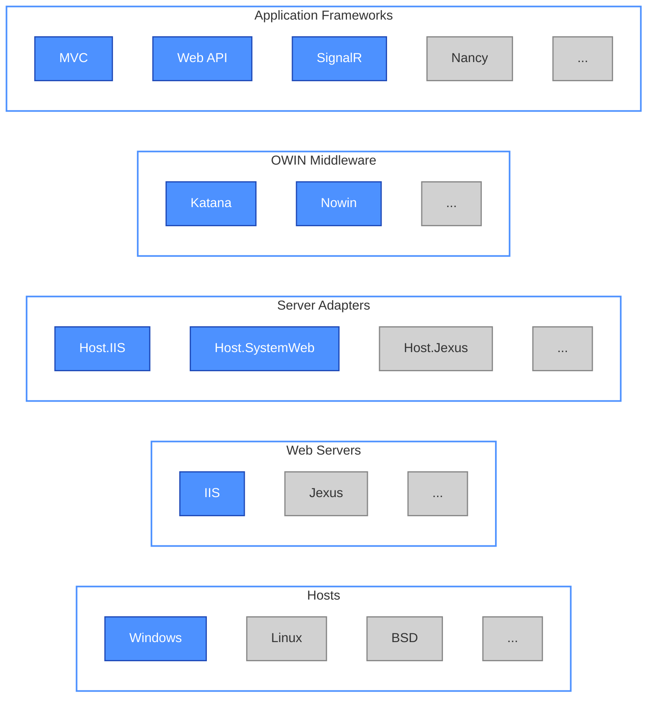

There are many articles discussing about OWIN even before ASP.NET vNext was announced. So why does it matter? Well, I try to provide a diagram nobody else yet drew.
<!--more-->

_Figure 1: OWIN ecosystem._

Got it now? From Microsoft's official documentation we can see their OWIN/Katana components (items in blue) help create decoupled layers, but you probably don't realize that many third party components (items in grey) are already out there to bring your web applications to a variety of computing platforms you never imagined. For example, can you imagine that a MVC 4 powered web app to run flawlessly on Jexus/Ubuntu on a Raspberry Pi board? Yes, that becomes reality right now.

OWIN focused on app frameworks and middleware in the past few months. The rising of Web server support, like what Jexus 5.6 (currently in beta) offers, is going to give more opportunities to ASP.NET developers.

Learn it now, or you will be left behind :)
