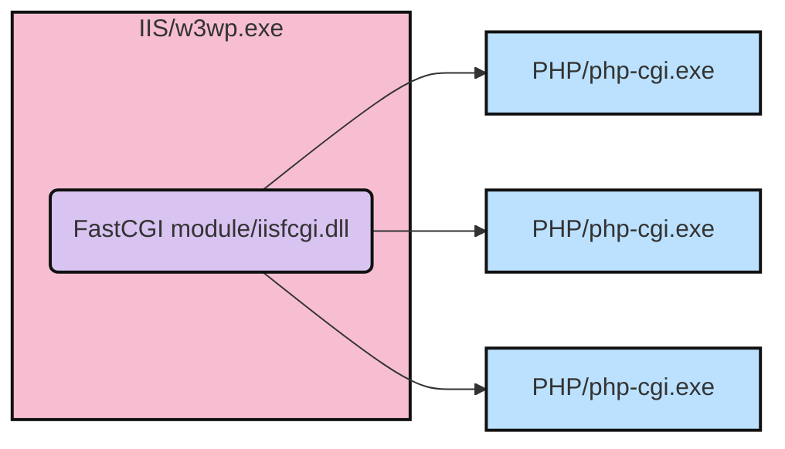

It is very important to know how many processes participate in request handling of PHP on IIS.
<!--more-->

_Figure 1: Process model of PHP on IIS._

Like the diagram shows, there are Microsoft processes, typically `w3wp.exe`. Such IIS worker processes host a native module called FastCGI module (`iisfcgi.dll`), that implements FastCGI protocol server side components. This module is included in IIS installation, and is usually optional. If you do want to host PHP apps on IIS, you should manually enable it.

Another set of processes are simply `php-cgi.exe`, a program coming from [PHP official package](https://windows.php.net/download/). This program implements FastCGI client side, so it can acquire incoming PHP requests from IIS side, and perform all kinds of duties.

So if you hit any issue with PHP, your very first task is to identify which process gives you the error message, and might be the culprit. Then accordingly we know what to do next.

* We usually see `php-cgi.exe` crashes, or experiences high CPU, or hangs. In that case you have to rely on [the PHP community](https://php.net/support.php) (Or if you use a commercial distribution from Zend, use Zend support).
* But if you do hit issues caused by `w3wp.exe` and `iisfcgi.dll`, you can contact [Microsoft support](https://support.microsoft.com).

> Update: July 10, 2020. [Microsoft plans](https://news-web.php.net/php.internals/110907) to stop supporting PHP on Windows.
>
> Update: Oct 20, 2023. Since PHP 7.x all reached end of life, PHP on Windows/IIS is no longer supported by Microsoft (I think even if you hit issues with Microsoft components). You should switch to Linux hosting as soon as you can. For example, now if you host an PHP 8.x web app on Microsoft Azure, the underlying OS is Linux.
