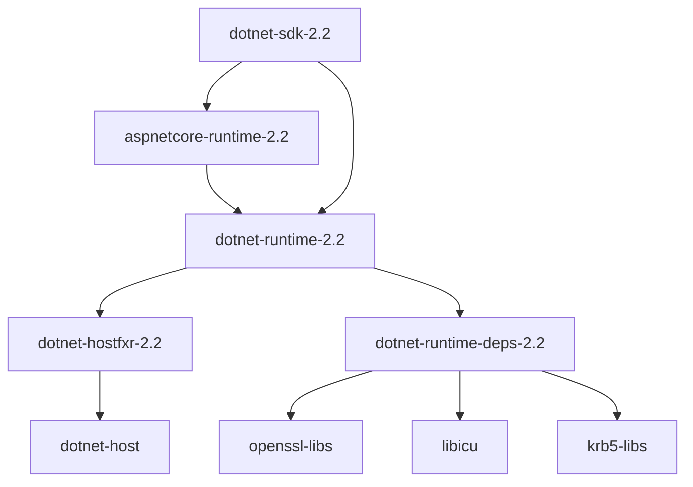
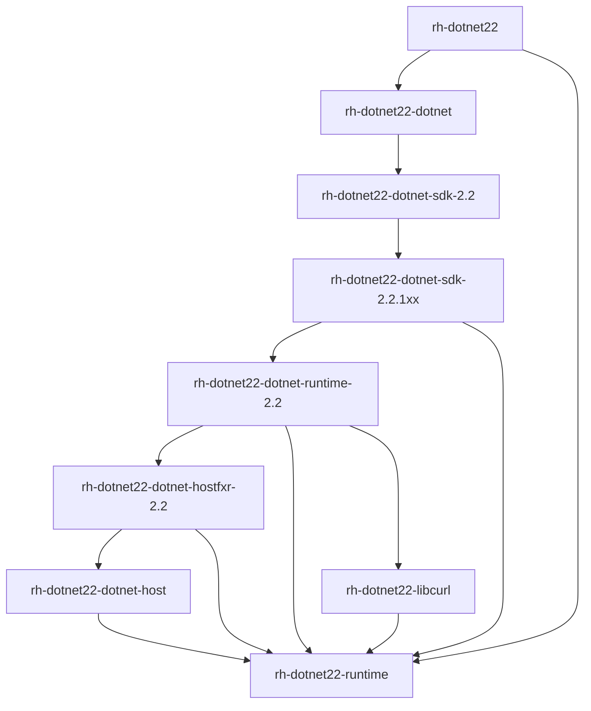

It is very important to learn what to install on a CentOS if you want to deploy a .NET Core application or set up a development environment there. So here we quickly go over the necessary details.
<!--more-->

## RPM Packages

The actual package we might install is,

* `dotnet-sdk-2.2` if we want a minimal .NET Core development environment.
* Or `aspnetcore-runtime-2.2` if we want to host an ASP.NET Core app in framework dependent deployment mode.
* Or `dotnet-runtime-2.2` if we only host a normal console application in framework dependent deployment mode.

From the diagram below we can see the dependency relationship among the RPM packages.


_Figure 1: .NET Core 2.2 RPM packages for CentOS 7._

## Native Dependencies

For CentOS 7, we can see three native dependencies (not part of .NET Core) are needed,

* openssl-libs (cryptographic API depends on it)
* libicu
* krb5-libs (Kerberos support)

If they are missing from the system, .NET Core apps or SDK won't function properly.

## Self-Contained Deployment

So what do we need if an application is published in self-contained deployment mode?

As the name indicates, .NET Core runtime bits are bundled with the application itself, and we don't need the SDK or runtime packages in that case.

However, keep in mind that `dotnet publish` won't include the native dependencies (three in CentOS 7 case) so we still need to manually install them,

``` bash
sudo yum install openssl-libs libicu krb5-libs
```

(though very likely they are already installed while you install CentOS.)

.NET Core installation/deployment on other Linux distributions might require different package names/commands, but I believe the general principles remain the same.

> Note that the packages for Red Hat Enterprise Linux 7 are much more complex, compared to CentOS 7. It is too lengthy to go over all the details, so I only attached its diagram,


_Figure 2: .NET Core 2.2 RPM packages for RHEL 7._
